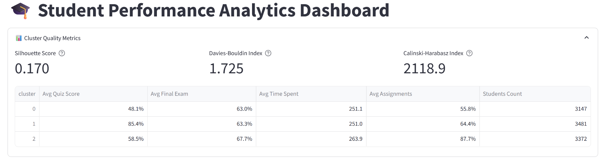

```markdown
# Student Performance Clustering and Recommendation System

This is a **Streamlit web application** that analyzes student performance, clusters students into performance-based groups (Low, Medium, High), and provides personalized course recommendations and adaptive learning suggestions.

## Features
1. **Student Performance Clustering**:
   - Groups students into Low, Medium, and High achievers based on their performance metrics (e.g., quiz scores, final exam scores, engagement levels).

2. **Personalized Course Recommendations**:
   - Recommends courses based on the performance and engagement levels of similar students.

3. **Adaptive Learning Suggestions**:
   - Provides personalized learning suggestions to help students improve in areas where they are weak (e.g., quiz performance, engagement).

4. **Course Material Analysis**:
   - Uses the **RoBERTa model** to analyze course materials and generate embeddings for further analysis.

## Dataset
The app uses the **Personalized Learning and Adaptive Education Dataset** from Kaggle. The dataset includes the following features:
- `Student_ID`: Unique identifier for each student.
- `Age`: Student's age.
- `Gender`: Student's gender.
- `Education_Level`: Student's education level (e.g., High School, Undergraduate, Postgraduate).
- `Course_Name`: Name of the course the student is enrolled in.
- `Time_Spent_on_Videos`: Total minutes spent watching videos.
- `Quiz_Scores`: Percentage score in quizzes.
- `Final_Exam_Score`: Percentage score in the final exam.
- `Engagement_Level`: Student's engagement level (Low, Medium, High).
- `Assignment_Completion_Rate`: Percentage of completed assignments.
- And more...

## How to Run the App Locally

### Prerequisites
1. **Python 3.8 or higher**.
2. **Streamlit**: Install using `pip install streamlit`.
3. **Other Dependencies**: Install the required libraries using the `requirements.txt` file.

### Steps
1. **Clone the Repository**:
   ```bash
   git clone https://github.com/your-username/student-performance-app.git
   cd student-performance-app
   ```

2. **Install Dependencies**:
   ```bash
   pip install -r requirements.txt
   ```

3. **Download the Dataset**:
   - Place the dataset (`personalized_learning_dataset.csv`) in the project directory.

4. **Run the App**:
   ```bash
   streamlit run app.py
   ```

5. **Access the App**:
   - Open your browser and navigate to `http://localhost:8501`.

## App Interface
1. **Student ID Input**:
   - Enter a student ID (e.g., `S00001`) to view their performance and recommendations.

2. **Performance Level**:
   - Displays the student's performance level (Low, Medium, High).

3. **Recommended Courses**:
   - Shows the most common courses taken by similar students.

4. **Adaptive Learning Suggestions**:
   - Provides personalized suggestions for improvement.

5. **Course Material Analysis**:
   - Enter course materials (e.g., "Introduction to Python") to analyze them using the RoBERTa model.

## Example Usage
1. Enter a valid student ID (e.g., `S00001`).
2. View the student's performance level, recommended courses, and adaptive learning suggestions.
3. Analyze course materials using the RoBERTa model.

## Screenshots



## Technologies Used
- **Streamlit**: For building the web app.
- **Scikit-learn**: For clustering (K-means) and nearest neighbors.
- **Transformers**: For RoBERTa-based course material analysis.
- **Pandas**: For data manipulation and analysis.

## Future Enhancements
- Add more advanced clustering techniques (e.g., DBSCAN, hierarchical clustering).
- Integrate with a database for dynamic data loading.
- Deploy the app on a cloud platform (e.g., Streamlit Sharing, Heroku).

